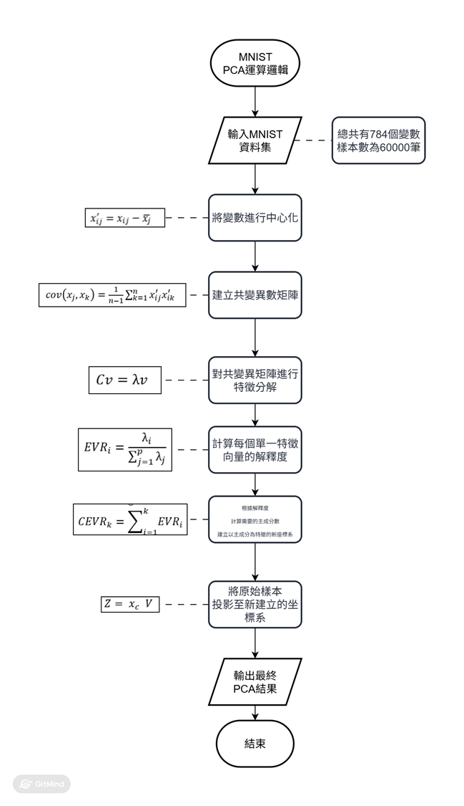
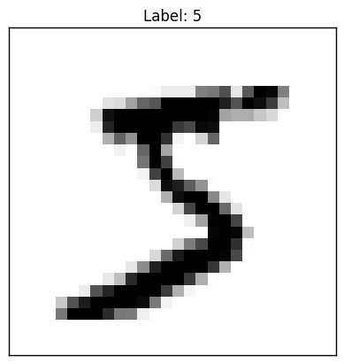

# Statistics-and-dimensionality-reduction
統計學及降維分析整理
## PCA簡介
PCA(Principal Component Analysis, 主成分分析)
是一種常見的降維方法

透過找出原始資料中的變異結構，將原始資料樣本投影至其變異結構上，並計算每個變異結構所包含的資訊量，根據資訊量進行捨棄維度，以達到降低變數數量及包含原始資訊的平衡
## PCA流程

# 特色公式
## 1、特徵分解

$$
Cv = \lambda v
$$

其中 $C$ 為共變異矩陣， $\lambda$ 為特徵值， $v$ 為特徵向量

特徵值 $\lambda$ ：資料沿著 $v$ 方向的變異量

特徵向量 $v$ ：在資料中的一個變異向量

## 2、解釋變異度
$$
EVR_i =
\frac{\lambda_i}
{\sum_{j=1}^{p}\lambda_j}
$$

$EVR_i$ 為Explained Variance Ratio,解釋變異比, $EVR$ ：表示第 $i$ 個主成分所解釋的變異量，佔全部變異量的比例

由 $\lambda_i$ 佔整體特徵值總和的比例決定；可解釋出對應 $v_i$ 所包含的資訊

### 累積解釋變異比

PCA會依照累積解釋變異比(Cumulative Explained Variance Ratio, CEVR)選擇保留的主成分數量

$$ 
CEVR_k = 
\sum_{i=1}^k EVR_i 
$$

當CEVR達到設定的門檻時，保留前 $k$ 個主成分，再降低維度時，保留足夠原始資訊

## 3、投影
目前只尋找到新的座標

=>將原始資料的樣本投影至新座標系上(主成分軸)

$$ Z_i = X_c V_i $$

# PCA演算法完整流程與實驗解釋

將實例MNIST資料集載入，已了解PCA是如何進行演算

## MNIST資料集簡單介紹

為一種手寫字的資料庫，將手寫的0~9透過 $28 /time 28$ 的像素格儲存

像素值為0~255

    不進行任何前處理，只是介紹演算法的變化

分成兩種資料集 *Train* 及 *test*

樣本數分別為
    
    Train ：60000
    
    Test ： 10000

這次介紹使用Train的60000筆進行介紹

舉例：手寫數字5

