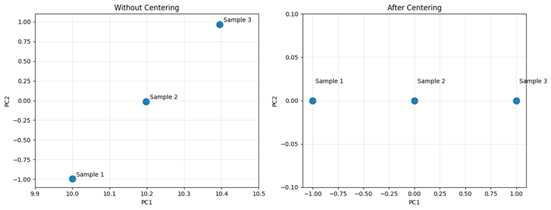
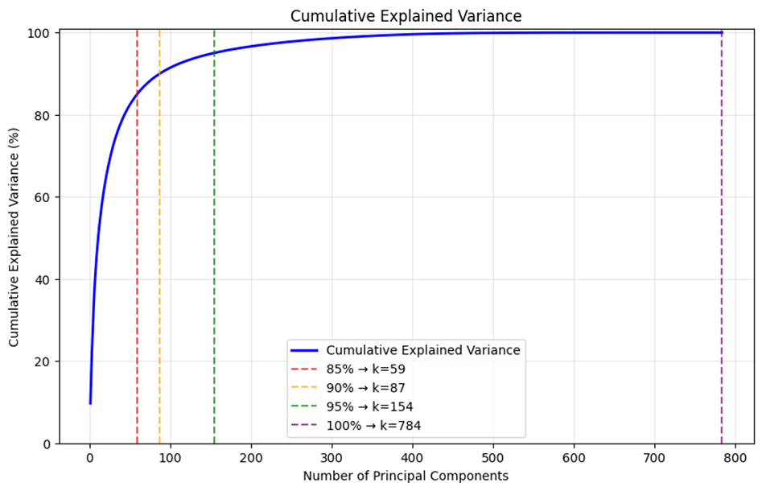

# Statistics-and-dimensionality-reduction
統計學及降維分析整理
## PCA簡介
PCA(Principal Component Analysis, 主成分分析)
是一種常見的降維方法

透過找出原始資料中的變異結構，將原始資料樣本投影至其變異結構上，並計算每個變異結構所包含的資訊量，根據資訊量進行捨棄維度，以達到降低變數數量及包含原始資訊的平衡
## PCA流程

# 特色公式
## 1、特徵分解

$$
Cv = \lambda v
$$

其中 $C$ 為共變異矩陣， $\lambda$ 為特徵值， $v$ 為特徵向量

特徵值 $\lambda$ ：資料沿著 $v$ 方向的變異量

特徵向量 $v$ ：在資料中的一個變異向量

## 2、解釋變異度
$$
EVR_i =
\frac{\lambda_i}
{\sum_{j=1}^{p}\lambda_j}
$$

$EVR_i$ 為Explained Variance Ratio,解釋變異比, $EVR$ ：表示第 $i$ 個主成分所解釋的變異量，佔全部變異量的比例

由 $\lambda_i$ 佔整體特徵值總和的比例決定；可解釋出對應 $v_i$ 所包含的資訊

### 累積解釋變異比

PCA會依照累積解釋變異比(Cumulative Explained Variance Ratio, CEVR)選擇保留的主成分數量

$$ 
CEVR_k = 
\sum_{i=1}^k EVR_i 
$$

當CEVR達到設定的門檻時，保留前 $k$ 個主成分，再降低維度時，保留足夠原始資訊

## 3、投影
目前只尋找到新的座標

=>將原始資料的樣本投影至新座標系上(主成分軸)

$$ Z_i = X_c V_i $$

# PCA演算法完整流程與實驗解釋

將實例MNIST資料集載入，已了解PCA是如何進行演算

## MNIST資料集簡單介紹

為一種手寫字的資料庫，將手寫的0\~9透過 $28 \times 28$ 的像素格儲存

變數總共有 784 個

像素值為0\~255

    此處不進行資料處理，僅介紹演算法的變化

分成兩種資料集 *Train* 及 *test*

樣本數分別為
    
    Train ：60000
    
    Test ： 10000

這次介紹使用Train的60000筆進行介紹

舉例：手寫數字5

### 輸入資料維度
   
$$
X \in \mathbb{R}^{60000 \times 784}
$$
    

每一列(Columns)：為一個變數，在這就是其中一個像素位置

    Pixel1、Pixel2、...、Pixel784

每一行(Row)：為一個樣本，在這為其中一張數字影像
    
    0、1、...、59999

## 演算法步驟

### Step 1 - Mean Centering（中心化）

$$
x_{ai}^{c} = x_{ai} - \mu_i
$$

$a$：第 $a$ 張影像

$i$：第 $i$ 個變數

$x_{ai}$：第 $a$ 張影像中的第 $i$ 個變數值

$\mu_i$：第 $i$ 個變數所有樣本的平均值

$$
\mu_i = \frac{\sum_{a=0}^{59999}x_{ai}}{60000}
$$

功能：移除絕對 0 點的影響，使主成分方向專注於資料變化進行分析

舉例：現有三個點(10,1),(10,2),(10,3)

,(10,2),(10,3).png)

未中心化(左側),中心化(右側)

可發現未進行中心化時，資料的重心不在絕對0點

=>資料整體位置也會影響 PCA 所找出的主要變異方向

此例中三個資料點的 $x_1$ 皆為 10

實際的資料變化只存在於 $x_2$ 方向

=>中心化後將資料重心移至原點，使 PCA 專注於樣本相對於重心的變化

### Step 2 - Covariance Matrix（共變異矩陣）

$$
C = \frac{1}{n-1}X_c^{T}X_c
$$

$X_c$：中心化後的資料所組成的矩陣

$T$：轉置矩陣

### 變異數與共變異數

**變異數（Variance）**

用於衡量單一變數本身的變化程度。

$$
Var(X_i)=\frac{1}{n-1}\sum_{a=1}^{n}(x_{ai}-\mu_i)^2
$$

變異數越大，代表該變數在不同樣本之間的變化越大

共變異數（Covariance）

用於衡量兩個變數之間的共同變化程度與方向

$$
Cov(x_i,x_j)=
\frac{1}{n-1}
\sum_{a=1}^{n}
(x_{ai}-\mu_i)(x_{aj}-\mu_j)
$$

共變異數：

- 正值：兩個變數傾向同方向變化
- 負值：兩個變數傾向反方向變化
- 接近 0：兩個變數沒有明顯的線性共同變化

#### 共變異矩陣中的元素

**對角線：**

代表各變數自己的變異數

$$
C_{ii}=Var(X_i)
$$

**非對角線：**

代表不同變數之間的共變異數

$$
C_{ij}=Cov(X_i,X_j)
$$

功能：將各變數本身的變異程度，以及變數之間的共同變化關係，整合成共變異矩陣，提供後續特徵分解尋找主要變異方向

$$
C \in \mathbb{R}^{784 \times 784}
$$

可以看出784個變數之間的共變異關係

行列(Row、Column)：都為變數

儲存格中：則代表對應的變異數或共變異數=>整合出一個共變異矩陣

### Step 3 - Eigendecomposition(特徵分解)

$$
Cv = \lambda v
$$

其中 $C$ 為共變異矩陣， $\lambda$ 為特徵值， $v$ 為特徵向量

功能：共變異矩陣可得知整體變數間的相關性，但並沒有實際告知哪個方向具有較大變異，及此方向的變異約為多少

=>透過特徵分解，找出變數間變異最大的方向

**特徵向量 $v$**：代表資料變異的方向
**特徵值 $\lambda$**：代表該方向的變異程度
**共變異矩陣 $C$**：描述各變數之間的變異關係

展現出每個特徵方向的變異程度

展示每個方向的向量組合

### 特徵值排序

特徵分解後會得到多組特徵值 $\lambda$ 與對應的特徵向量 $v$。

將特徵值由大到小進行排序：

$$
\lambda_1 \geq \lambda_2 \geq \lambda_3 \geq \cdots \geq \lambda_{784}
$$

並將對應的特徵向量按照相同順序排列。

**特徵值越大**：代表該特徵向量所代表的方向具有越大的資料變異。

=>排序後：

- 第 1 個特徵向量 → 第一主成分（PC1）
- 第 2 個特徵向量 → 第二主成分（PC2）
- 第 3 個特徵向量 → 第三主成分（PC3）
- $\cdots$

=> 將變異最大的方向排在最前面，方便後續選擇主要的主成分

### Step 4 - Explained Variance Ratio（EVR）與 Cumulative Explained Variance Ratio（CEVR）

特徵值排序後，可透過特徵值計算每個主成分所能解釋的變異比例

**Explained Variance Ratio（EVR）**

$$
EVR_i=
\frac{\lambda_i}
{\sum_{j=1}^{784}\lambda_j}
$$

EVR 表示第 $i$ 個主成分所保留的資料變異比例

---

**Cumulative Explained Variance Ratio（CEVR）**

將前面的 EVR 依序累積：

$$
CEVR_k=
\sum_{i=1}^{k}EVR_i
$$

CEVR 表示使用前 $k$ 個主成分時，累積保留的資料變異比例

可以看出隨著主成分數量增加，CEVR 逐漸提高，但後期增加的幅度逐漸變小

=> 可以透過 CEVR 曲線，選擇適當的主成分數量，在資訊保留與降維程度之間取得平衡

### Step 5 - Projection（投影）

經過前面的特徵分解與排序後，選擇前 $k$ 個特徵向量作為主要的變異方向。

將這些特徵向量組成矩陣：

$$
V_k=
[v_1,v_2,\cdots,v_k]
$$

其中 $k$ 為選擇的主成分數量。

將中心化後的資料投影至這些主要變異方向：

$$
Z=X_cV_k
$$

其中：

- $X_c$：中心化後的資料矩陣
- $V_k$：前 $k$ 個特徵向量所組成的矩陣
- $Z$：投影後的資料
- $k$：保留的主成分數量

原始資料：

$$
X_c\in\mathbb{R}^{60000\times784}
$$

若選擇前 100 個主成分：

$$
V_{100}\in\mathbb{R}^{784\times100}
$$

因此：

$$
Z=X_cV_{100}
$$

得到：

$$
Z\in\mathbb{R}^{60000\times100}
$$

原本每張影像具有 784 個變數，經過投影後，只使用 100 個主成分表示。

=> 透過投影，將原始資料轉換至由主要變異方向所形成的低維空間，完成降維。
